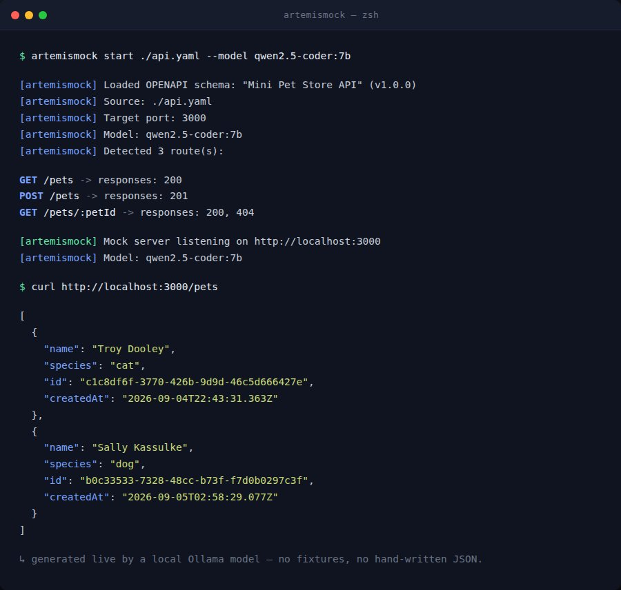

# ArtemisMock

**AI-guided, fully local real-time mock API server.**

ArtemisMock reads your existing OpenAPI/Swagger or Prisma schema and spins up a real, running HTTP mock server for it — instantly. No manual fixture files, no hand-written JSON, no cloud service. Every response is generated on the fly by a **local LLM running through [Ollama](https://ollama.com)**, so the data your frontend or QA team sees looks like real-world data — coherent names, emails, dates, and IDs — instead of `"string"` placeholders.

If the model is slow or not running, ArtemisMock falls back instantly to a schema-aware synthetic-data generator. The mock server never goes down because of the AI layer.



## Why teams use it

- **Ship the frontend before the backend exists.** Point ArtemisMock at the OpenAPI spec your backend team already agreed on, and your frontend/QA team gets a fully working, realistic API today.
- **Zero cloud dependency.** Everything — the schema parsing, the AI generation, the HTTP server — runs on your machine. No API keys, no data leaving your network, no per-request billing.
- **Schema-aware, not schema-blind.** OpenAPI 3.x, Swagger 2.0, and Prisma schemas are all normalized into one internal representation, so the same AI generation and rule engine work identically no matter which format your project uses.
- **Chaos testing in plain English.** Describe failure conditions the way you'd explain them to a teammate — `"POST /payments fails 20% of the time with HTTP 500, and GET /users has 800ms of latency"` — and ArtemisMock turns that into enforced per-route rules. No rules DSL to learn.
- **Full CRUD from a Prisma schema.** Point it at `schema.prisma` and get a complete REST surface (`GET/POST` on the collection, `GET/PUT/PATCH/DELETE` on `/:id`) for every model, automatically.
- **Safe by default.** The server binds to `localhost` only unless you explicitly opt into exposing it on your network.

## How it works

1. **Parse** — ArtemisMock reads your OpenAPI/Swagger or Prisma schema and builds a route map: every path, method, parameter, and response shape.
2. **Serve** — a real Fastify HTTP server is started, with one handler registered per route.
3. **Generate** — on each request, the route's JSON Schema is sent to a local Ollama model with a strict prompt asking for a single realistic JSON value matching it. The call is capped at a 2-second timeout.
4. **Fall back safely** — if Ollama is slow, not installed, or returns something unusable, ArtemisMock instantly generates an equivalent value with a schema-aware synthetic-data engine instead. Your API call always gets a valid response.

```
$ artemismock start ./api.yaml --model qwen2.5-coder:7b

[artemismock] Loaded OPENAPI schema: "Mini Pet Store API" (v1.0.0)
[artemismock] Detected 3 route(s)
[artemismock] Mock server listening on http://localhost:3000

$ curl http://localhost:3000/pets
[
  { "name": "Troy Dooley", "species": "cat", "id": "c1c8df6f-...", "createdAt": "2026-09-04T22:43:31.363Z" },
  { "name": "Sally Kassulke", "species": "dog", "id": "b0c33533-...", "createdAt": "2026-09-05T02:58:29.077Z" }
]
```

## What's included

- Full TypeScript source, built with a strict, typed architecture (Clean Architecture-style separation between schema parsers, the AI client, and the HTTP server).
- OpenAPI 3.x / Swagger 2.0 parser with full `$ref` and `allOf` resolution.
- Dependency-free Prisma schema parser generating complete CRUD routes.
- Local Ollama client with automatic timeout and fallback.
- Natural-language rule engine for latency/error injection.
- A ready-to-run CLI (`artemismock start <schema>`) built and bundled for immediate use.

This is the commercial distribution of ArtemisMock's private repository. Purchasing grants you access to the full source on GitHub.

## Get access

<p align="center">
  <a href="https://www.paypal.com/ncp/payment/KN78NFJJBQFEY">
    
  </a>
  <br>
  <a href="https://www.paypal.com/ncp/payment/KN78NFJJBQFEY"><strong>Pay with PayPal →</strong></a>
</p>

After payment, you'll be invited as a collaborator to the private `ArtemisMock` repository with the full source, test suite, and documentation.

## Requirements

- Node.js 20+
- [Ollama](https://ollama.com) (optional, but recommended — ArtemisMock works without it via the fallback generator)

## License

Commercial — see the private repository for full terms upon purchase.
